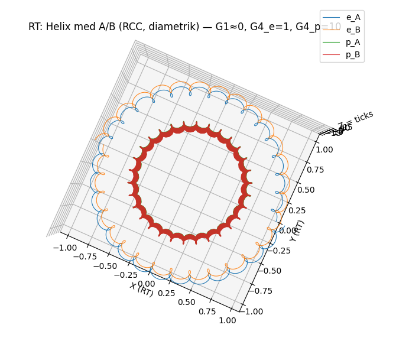

## Postulates vs Locked Discoveries (v1.1 — stricter, less attackable)

*Cover figure generated with the canonical A/B helix viewer. An optional viewer script is included under `Release/docs/archive/` (not part of verification).*

### Purpose of this page
To separate **what is posited to exist** (postulates) from **what is currently treated as fixed gates because alternative discrete options fail RT‑internal audits/negative controls** (locked discoveries). Anything not in Postulates must be either **derived** or explicitly labeled as a **locked discovery** until derived.

---

## 1) Ontology postulates (what exists)

**P1. Primal Plane (PP) exists and is primary.**
Objects are defined in PP. What is called “measurement” is a projection/sampling view (RP), not a separate ontological arena.

**P2. TP objects exist.**
A TP is a tick-driven TimeParticle in PP. As it evolves, it writes a **trace**: a 1D curve (“string/cord”) in PP. Multi‑TP systems exist as collections of TPs plus their relations (and their written traces).

**P3. A phase‑tension field exists (pressure/pull vocabulary).**
There exists a field/functional representing **phase tension** (synonyms: phase pressure, phase pull). It can store disharmony and mediate interactions between TP objects.

> These three are the minimal ontology. They do **not** yet specify the full dynamics.

---

## 2) Dynamics postulates (only if used)
These are not “what exists” but “how it evolves.” If used, they must be admitted as postulates until derived.

**D1. Retarded TickPulse update (global tick schedule).**
The system evolves by discrete tick updates (a “rear‑driven pulse”). The tick schedule is **globally synchronous**: each tick advances the **entire PP state** (one universe-step per tick). “Retarded” means influences propagate through the tick-to-tick dynamics (no instantaneous action at a distance).

**D2. Existence of an attractor / variational principle.**
Stable structures are attractors/minima of a cost/tension functional subject to constraints (e.g., exclusion/no‑overlap).

**D3. PP speed budget (maximum propagation speed).**
There exists a maximum propagation speed for disturbances in PP (in RT units set to 1). In overlay, this maps to the observed speed of light \(c\).

**D4. Cap reset micro-mechanism (P‑ARM, if invoked).**
If the cap is decomposed into a 6-tick bias-reset superpacket plus a 1-tick arming/disarming step (P‑ARM), then L_cap=7 becomes structural when L_active fixes the residue.

---

## 3) Locked discoveries / Gates (NEG‑backed, not yet derived from P1–P3)
**Locked discoveries are treated as fixed because alternative discrete options fail RT‑internal audits/NEG controls, not because they are assumed true a priori.**
They are not yet proven consequences of only P1–P3.

**L1. C30 stroboscopic gate (K = 30).**
A discrete 30‑slot sampling/period is required. Neighbor periods (e.g., 29/31) serve as negative controls and fail.

**L2. Z2 (A/B) two‑branch structure.**
A fundamental two‑branch (parity/doublet) channel is required (often tracked as \(\beta\)/AB).

**L3. Z3 sector structure (with a discrete weighting rule).**
A three‑sector structure is required. Given Z3, the nontrivial real weight **(2, −1, −1)** is a structural consequence of the 3‑cycle (unique up to scale/permutation). The use of Z3 itself remains a gate until derived from minimal postulates.
(Details: `00_TOP/RT_Z3_Z6_RHO_LEMMAS_v1.md`.)

**L4. No‑overlap (address exclusion) in RP_strob for atomic ordering.**
An exclusion rule preventing certain co‑occupations (a Pauli‑surrogate) is required for stable ordering. This is a gate, not yet derived from P1–P3.

**L5. \(\rho = 10\) / “ten‑per‑tick” audit constraint.**
A discrete 10‑to‑1 macro constraint appears as required by internal audit consistency checks (e.g., “ten‑per‑tick” extrema/chord ratio). It is also the C30 factor that keeps a nontrivial Z3 ledger aligned (since 30/10 = 3). Presently fixed.
(Details: `00_TOP/RT_Z3_Z6_RHO_LEMMAS_v1.md`.)

**L6. “No SI inside Core” governance rule.**
Not a physics postulate, but a methodological gate: SI constants/scales are allowed only in overlay for comparison.

**L7. Global Frame gate (L_* = 1260).**
A universal frame length L_* = 1260 tick is used as a hard constraint in the hydrogen/emission chain. It is currently treated as a locked discovery/postulate until derived from TickPulse.

**L8. Photon mode-gate (C30 | N_λ).**
Given L_* and the definition N_λ = L_*/M, C30 compatibility requires 30 | N_λ, which (under L_*=30·42) is equivalent to M | 42. NEG: M∤42 fails.

**L9. GATE‑CAP closure (L_cap = (−L_active) mod 30).**
For an active window length L_active, drift-free closure to the C30 lattice requires L_active + L_cap ∈ 30Z. For L_active=1253 this implies L_cap=7; a minimal extra postulate (P‑ARM) can make 7 structural.

**L10. EM-invariant / two-edge measure (Ξ_RT).**  
Core uses a dimensionless EM invariant \(\Xi_{RT}:=Z0_{RT}G0_{RT}\) (”two-edge measure”, often nicknamed “2α” when compared in overlay).  
It appears consistently across independent internal routes (impedance×transport, AB-loop, tick-averages), but a fully Core-only numeric closure is still pending; α is overlay-only for verification.

---

## 4) Conditional derived claims (given Postulates + Gates)
These are **claims of consequence** once (P1–P3 + D1–D3 + L1–L6) are accepted. They are not claimed to follow from P1–P3 alone.

**H1. Phase‑tension sourcing ("gravity" in Overlay language).**
Phase tension acts as a source for an effective potential field; the inverse‑square behavior arises from flux logic on the retarded field (as read out in RP).

**H2. Relativity as projection/budget, not extra ontology.**
Relativistic effects are interpreted as PP→RP projection of a fixed PP speed budget: more transverse motion implies reduced forward‑time advance in RP.

**H3. Mass/inertia as a derived label, not an object.**
Mass is the minimal locked cost (rest) and the response (second variation) against trajectory change. The Overlay notion of gravitational mass coincides with inertial mass if both depend on the same tension functional.

**H4. EM/low‑Q²/hydrogen constraints (Core→Overlay).**
Core yields dimensionless relations; overlay maps to SI and performs tests. (No SI enters the Core derivations.)

**H5. Atom/periodicity engine is a demonstrator.**
V7 atomic ordering is treated as a consequence module; any ingredient not traced back to V6‑Core + gates must be reclassified as a new gate until derived.

---

## 5) Public‑honest one‑liner (recommended)
> “RT posits PP, TP curves, and a phase‑tension field. Several discrete structures (C30, Z2, Z3, no‑overlap, \(\rho=10\), and the current Global Frame \(L_* = 1260\) + mode/cap gates) are at present locked discoveries: they survive internal audits and negative controls but are not yet derived from the minimal postulates. All SI comparisons occur only in overlay.”

---

## 6) What must happen to reduce postulates
To legitimately claim “only PP + TP + phase tension (+ TickPulse dynamics),” you would need derivations of:
- C30 (K=30),
- Z2, Z3 sectoring (and the weighting rule),
- no‑overlap,
- \(\rho=10\),
- Global Frame \(L_*\) and the mode gate,
- GATE‑CAP (and why cap=7 is structural),
from the minimal ontology + dynamics, with negative controls preserved.
