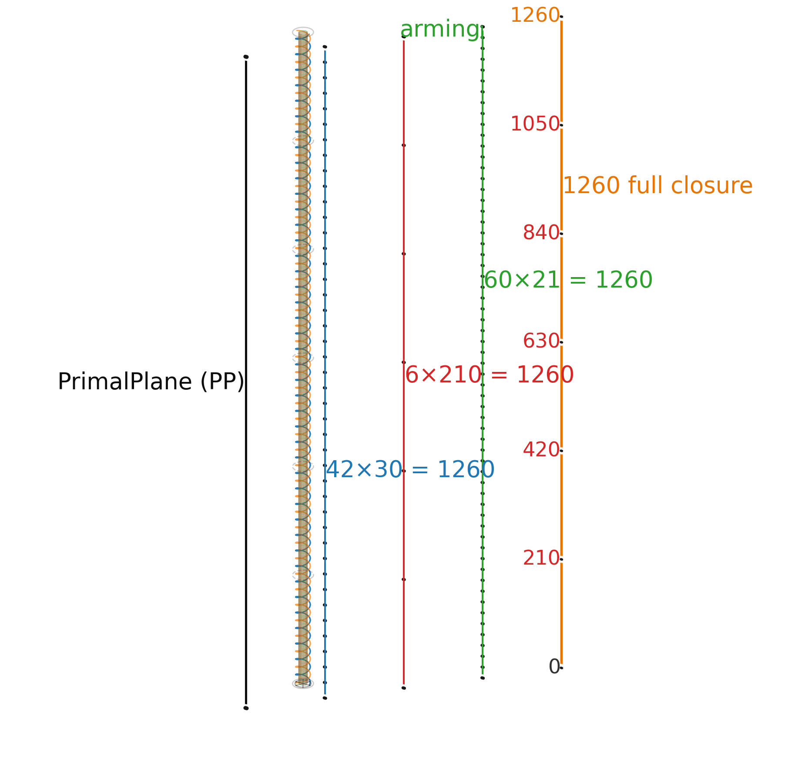
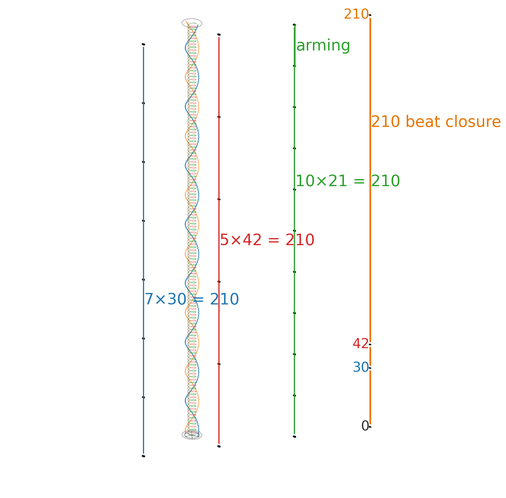
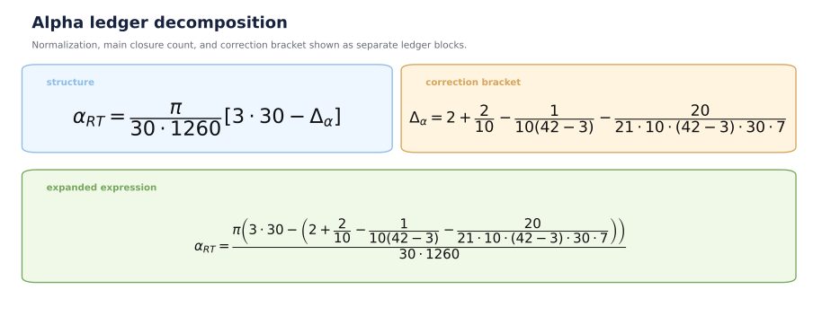
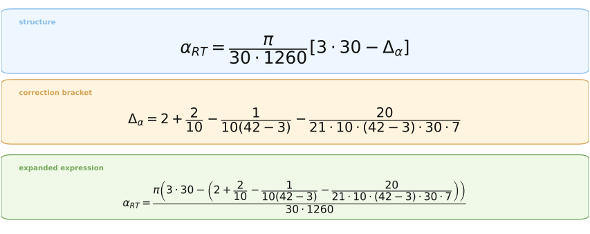

# CLAIM - Alpha as a Frozen Closure Ledger

*The expression is not fitted; it is read from named closure structure.*

## Visual closure anchors

- Full closure: `1260 = 6 x 210 = 42 x 30 = 60 x 21`
- Beat closure: `210 = 7 x 30 = 5 x 42 = 10 x 21`

The expression is written as a closure ledger. The integers are not introduced as adjustable constants; they are named positions in the RT release geometry before the numerical value is judged. The local beat cell comes first; full closure is six such cells.

## Claim test

To refute it, identify the free term, the invalid ledger link, or a stricter ledger that gives another value.

---

# CLAIM TEST - Break the Ledger

*Every objection must point to a specific term, link, or stronger alternative ledger.*

## Formula structure

- Normalization: `30 x 1260` = C30 readout grid times full closure.
- Main count: `3 x 30` = three-sector count over C30.
- Correction bracket: A/B, rho, sector gap, and active `20/21` duty.

## Term ledger

Only ledger-compatible closures survive the fixed release geometry.

| Symbol / term | Ledger meaning | Role |
|---|---|---|
| pi | rotor / circular phase normalization | turns closure defect into angular measure |
| 30 | C30 readout grid | base unit in numerator and denominator |
| 42 | closure wave count | combines with 30 into full closure |
| 1260 | full closure | 6 x 210 = 30 x 42; global normalization |
| 210 | local beat closure | lcm(30,42) = 210; precedes full closure |
| 7 | local beat leg: 210 / 30 | C30 side of beat cell; not derived from 1260 |
| 5 | 210 / 42 | 42-wave side of beat cell |
| 21 | 210 / 10 = 42 / 2 = 3 x 7 | alpha window / arming interval |
| 20/21 | active fraction inside 21-window | final duty correction |
| 2 | A/B two-sided readout | leading correction term |
| 3 | sector structure | appears in 3 x 30 and 42 - 3 |
| 42 - 3 = 39 | closure wave reduced by sector count | gap denominator |
| 10 | rho division | local subdivision / scaling denominator |

## Correction bracket, term by term

- `2`: A/B base.
- `2/10`: A/B read through rho = 10.
- `1/[10(42-3)]`: sector-reduced closure gap.
- `20/[21*10*(42-3)*30*7]`: active 20/21 duty inside beat/C30 ledger.

## Final claim

`alpha_RT` is proposed as a closure-geometric entity, structurally analogous to `pi`:

`pi` measures circular closure; `alpha_RT` measures closure defect in the RT release ledger.
