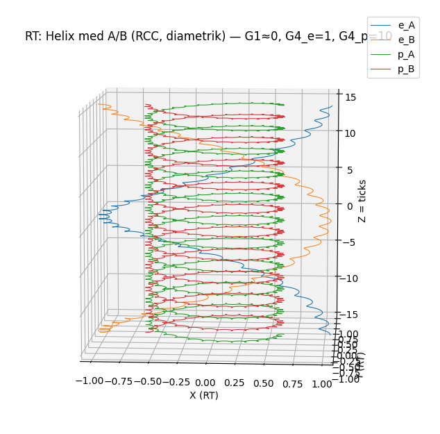

# RytmTeorin (RT) — Public Release (FULL)

**Author:** Bo Fremling  
**Version:** v1.0.1  
**Release date:** 2026-03-01



RT is an attempt to derive physics from discrete rhythm (**TickPulse**), geometry (**PP**), and a readout boundary (**RP**), rather than from fitted parameters.


## Provenance

This release is tied to a specific author and version on purpose:

- `PROVENANCE.md` — what the release is and how to reproduce results
- `PRIOR_ART.md` — public disclosure statement
- `CITATION.cff` — citation metadata
- `LICENSE` — MIT license
## Introduction
(Bo Fremling)

RT (“RytmTeori”) is an **ontology-first** project: it starts from a minimal set of primitives treated as the base, and requires that everything else can be **derived** from them.

### About the author and the format

This is an independent release by me, **Bo Fremling**, built from ideas and insights developed over more than 50 years.
I have no institutional affiliation and no formal physics education beyond high school. For that reason, the release is designed to be reviewable without authority:

- deterministic runs,
- audit logs,
- negative controls,
- a hard separation between facit-free derivation and the subsequent comparison.

Terminology (project-specific):
- **facit** (Swedish) = an external “answer key”: any reference/target values (e.g. PDG, CODATA, stored targets, overlay reference JSON) that would allow the system to steer toward known results.
- **facit-free derivation (Core)** = the derivation step is forbidden to read or use any facit. It must generate candidates using RT-internal rules only.
- **Compare/Overlay** = a separate step that may read facit, but only to report AGREE/TENSION/UNTESTED after Core artifacts exist.

If you do only one thing: run verification and then open
- `out/SM29_PAGES.md`
- `00_TOP/LOCKS/SM_PARAM_INDEX/SM_29_REPORT.md`

### The ontology (what exists)

RT assumes, at the base:
- **PP (Primal Plane):** an **infinite xy-plane** where **z is time** (not “depth”).
- **RP (Real Plane):** the surface/screen where observations are expressed; RP is **not** the generative arena but the **readout**.
- **TickPulse:** a discrete, **globally synchronous** update step: each tick advances the **entire PP state** (one universe-step per tick). This does not mean “instant action at a distance”; it means the update schedule is shared across PP.
- A small number of explicit symmetries/gates (e.g. C30/Z3/A-B/RCC) and **negative controls** that must come out as FAIL.

### The theory (how it develops)

The theory specifies how states in PP are updated tick-by-tick and how they are **projected into RP** as measurable quantities.

For the foundations map of Ontology/Core/Theory, see:
- `00_TOP/RT_FOUNDATION_ONTOLOGY_CORE_THEORY_v1.md`

### Why SM29 is included

The Standard Model contains many quantities it does not explain — **free parameters** that normally must be measured and inserted. This project tracks a set of 29 targets under the label **SM29**.

Important: **SM29 is project shorthand**, not a claim that every item is a strict “Standard Model parameter”.
For example, **κ (kappa)** is a **unit anchor used only for mapping RT quantities into SI units in the comparison layer**; it is not a Standard Model parameter.

SM29 is included to increase credibility and falsifiability:
- First, a **facit-free derivation (Core)** is executed.
- Then, **Compare/Overlay** is executed; it may read references and reports AGREE/TENSION/UNTESTED.

### Optional: independent AI review

You can also drop this release into any LLM and ask it to *trace* where each reported quantity comes from.
If you do this, require the model to:
- point to **exact file paths** and the **exact script outputs**,
- avoid claims without repo locations,
- respect the **Core vs Compare** separation.

Suggested prompt:
“Read this repository and explain, for each SM29 item, exactly which scripts and artifacts produce it. Quote file paths and commands. If something is not derived, label it clearly as an anchor or compare-only.”
Or:
"Tell me how RT explains double-slit or why “interference” can appear"

---

This folder (**Release/**) is intended to be the **only public root**.

## Quick start

Run from the **Release root** (the directory that contains `00_TOP/`):

```bash
bash verify_all.sh
```

This runs, in order:
1) Core suite (facit-free + determinism + overlay-off test)
2) Compare suite (overlay-only)
3) SM29 overlay triage (data-match)
4) SM29 report + reviewer pages

## What to read after running (results first)

If you only open one results file, open:
- **SM29 Pages (generated navigation):** `out/SM29_PAGES.md`

Then read:
- **Executive status (SM29):** `00_TOP/LOCKS/SM_PARAM_INDEX/SM_29_REPORT.md`

Other useful outputs:
- **Core index:** `out/CORE_SM29_INDEX/`
- **Compare index:** `out/COMPARE_SM29_INDEX/`
- **Audits:** `out/CORE_AUDIT/` and `out/COMPARE_AUDIT/`

## Optional: ask a separate “private chat” to review

If you want an independent reviewer/AI to reproduce + audit the release, use:

- `docs/PRIVATE_CHAT_REVIEW_PROMPT.md`

Copy/paste that file as the **first** message in a new chat. The prompt asks the reviewer to reply in **the user’s language**.

## Suggested reading order (theory / policy)

0) Single foundation map (Ontology/Core/Theory): `00_TOP/RT_FOUNDATION_ONTOLOGY_CORE_THEORY_v1.md`
   - No-facit threat model (what is/ isn’t covered): `00_TOP/RT_NO_FACIT_THREAT_MODEL_v1.md`
   - Trace examples (how to audit one constant end-to-end): `00_TOP/RT_REVIEWER_TRACE_EXAMPLES_v1.md`
1) High-level picture (no math): `00_TOP`/**RythmTheory_for_interested.md**
2) Postulates vs locked discoveries: `00_TOP/RT_POSTULATES_VS_LOCKED_DISCOVERIES_v1_1.md`
3) Ontology map + glossary: `00_TOP/RT_ONTOLOGY_MAP_AND_GLOSSARY_v1.md`
4) Lemma pack (Z3 weight, Z6 closure, rho compatibility): `00_TOP/RT_Z3_Z6_RHO_LEMMAS_v1.md`
5) Compute map (end-to-end wiring): `00_TOP/RT_V7_COMPUTE_MAP_v1_2026-02-05.md`
6) Contracts / policy:
   - `00_TOP/CORE_CONTRACT_NO_FACIT.md`
   - `00_TOP/RT_GOVERNANCE_NO_SI_NEG_POLICY_v1.md`
   - `00_TOP/RT_CORE_CONTRACT_GLOBAL_v1_2026-01-06.md`

## Minimal glossary

- **TP = TimeParticle.**
- **PP** = Primal Plane (primary arena in Core).
- **RP/Σ** = Real Plane / measurement screen (projection used for observation/compare).
- **C30** = 30-slot stroboscopic sampling rule.
- **A/B** = the two-strand rule (π-phase counterpart).

## Optional (not required for verification)

- Archive viewer scripts (V6): `docs/archive/README.md`
- Legacy notes (not part of reviewer flow): `docs/legacy/README.md`

## Important

- Core must not open `00_TOP/OVERLAY*`, any `*reference*.json`, or any non-system path outside the repo (audited).
